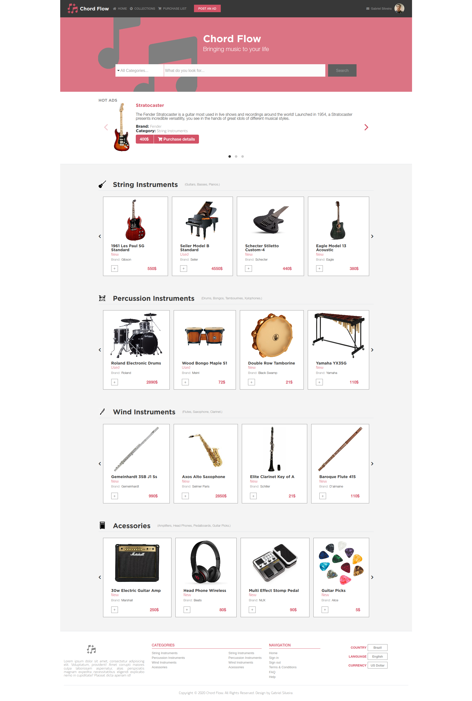
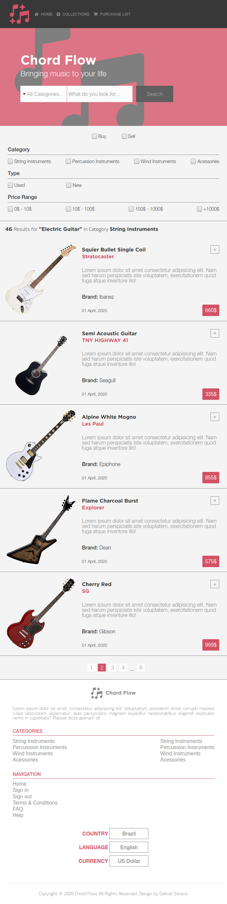
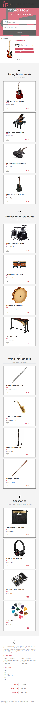

# onlineShop

In this project I choose to created a music online shop with a 'main with search' and 'results' page. 
I used a lot of knowledge acquired throughout the HTML & CSS section, such as semantic html, positioning of content with bootstrap and flexbox among others. Also for learning purposes and to see if I could use different frameworks used 'Flickity' to build a carousel (just on a minor element to see it working, didn't want to abuse it because I wanted to show more CSS skills learned throught Microverse HTML & CSS section).
Worked for the requirements on two different main versions, showing the content as required, one for fullscreen >= 768px another for < 768px. I saw that I could improve it a little more on smaller screens, so I worked with some adjustments when a screen became less than 576px.

# Large Screen (Search page/Results page)




# Medium Screen (Search page/Results page)





# Small Screen (Search page/Results page)




## Built With

   - HTML,
   - CSS,
   - Bootstrap,
   - Font Awesome,
   - Flickity,
   - [Design by Mohammed Awad](https://www.behance.net/gallery/24796463/ZATTIX)

## Live Demo

[Live Demo Link](https://rawcdn.githack.com/Stricks1/onlineShop/0d3e0b7f418cfa651fea0532bad6746c63003284/index.html)

## Getting Started

You can get a local copy of the repository please run the following commands on your terminal:

```
$ cd <folder>

$ git clone git@github.com:Stricks1/onlineShop.git
```
To navigate between the pages you can use the 'Search' button to go for the Results page, and to get back to main page you can use any of the 'Home' nav links, one is on the header and the other on the footer.

## Authors

👤 **Author**

- Github: [@Stricks1](https://github.com/Stricks1)
- E-mail: [Gabriel Silveira](mailto:gmalheiross@gmail.com)
- Linkedin: [Gabriel Silveira](https://linkedin.com/in/gabriel-malheiros-silveira-b6632061/)

## 🤝 Contributing

Contributions, issues and feature requests are welcome!

Feel free to check the [issues page](issues/).

## Show your support

Give a ⭐️ if you like this project!

## 📝 License

- Project Capstone from Microverse HTML & CSS curriculum
- Design idea (layout, colors, font) was inspired by Mohammed Awad, you can find the original idea on [Behance](https://www.behance.net/gallery/24796463/ZATTIX)
- Used [Flickity](https://flickity.metafizzy.co/) tool to build the Hot Ads carousel - You can see the Flickity GitHub repo [here](https://github.com/metafizzy/flickity)